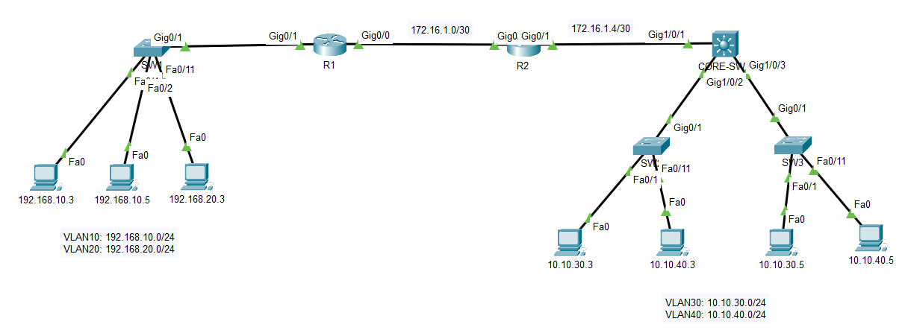

# CCNA Lab Review Part 1

*SonNVQ*



# Config VLAN

## R1

```c
int g0/0
    ip add 172.16.1.1 255.255.255.252
    no shut
int g0/1
    no shut
int g0/1.10
    encapsulation dot1Q 10
    ip add 192.168.10.1 255.255.255.0
int g0/1.20
    encapsulation dot1Q 20
    ip add 192.168.20.1 255.255.255.0
```

## R2

```c
int g0/0
    ip add 172.16.1.2 255.255.255.252
    no shut
int g0/1
    ip add 172.16.1.5 255.255.255.252
    no shut
```

## SW1

```c
int range fa0/1-10
    switchport mode access
    switchport access vlan 10
int range fa0/11-20
    switchport mode access
    switchport access vlan 20
```

## CORE-SW1

```c
ip routing
int g1/0/1
    no switchport
    ip add 172.16.1.6 255.255.255.252
    no shut
int range g1/0/2-3
    switchport mode trunk
vlan 30
vlan 40
int vlan 30
    ip add 10.10.30.1 255.255.255.0
int vlan 40
    ip add 10.10.40.1 255.255.255.0
```

## SW2

```c
int range fa0/1-10
    switchport mode access
    switchport access vlan 30
int range fa0/11-20
    switchport mode access
    switchport access vlan 40
```

## SW3

```c
int range fa0/1-10
    switchport mode access
    switchport access vlan 30
int range fa0/11-20
    switchport mode access
    switchport access vlan 40
```

# Config OSPF

## R1

```c
router ospf 110
    router-id 172.16.1.1
    network 172.16.1.0 0.0.0.3 area 0
    network 192.168.10.0 0.0.0.255 area 10
    network 192.168.20.0 0.0.0.255 area 10
```

## R2

```c
router ospf 110
    router-id 172.16.1.2
    network 172.16.1.0 0.0.0.3 area 0
    network 172.16.1.4 0.0.0.3 area 0
```

## R3

```c
router ospf 110
    router-id 172.16.1.6
    network 172.16.1.4 0.0.0.3 area 0
    network 10.10.30.0 0.0.0.255 area 20
    network 10.10.40.0 0.0.0.255 area 20
```